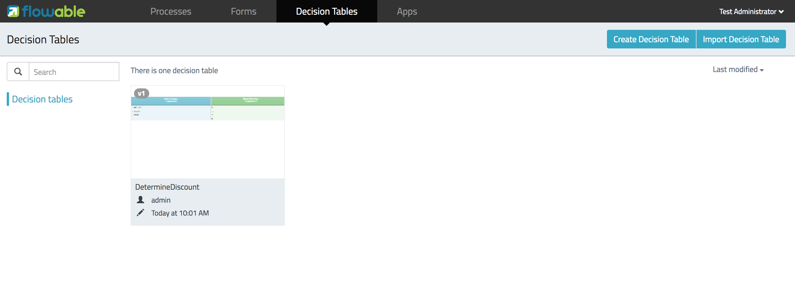
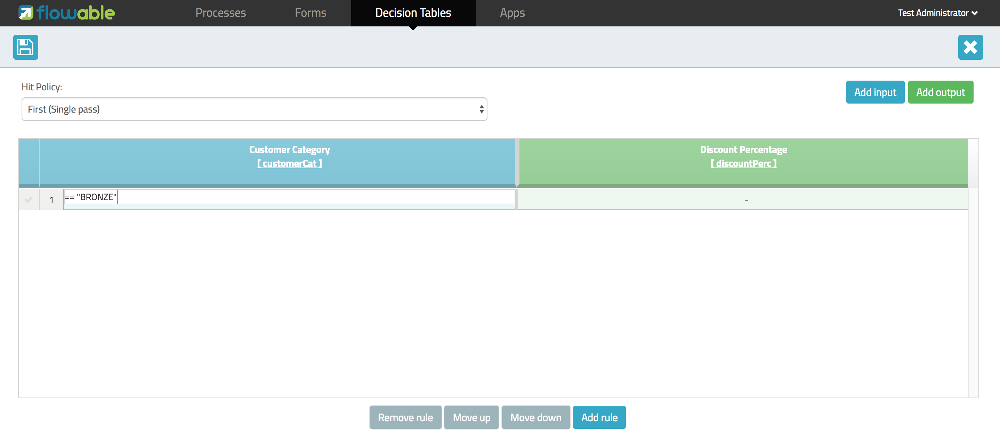
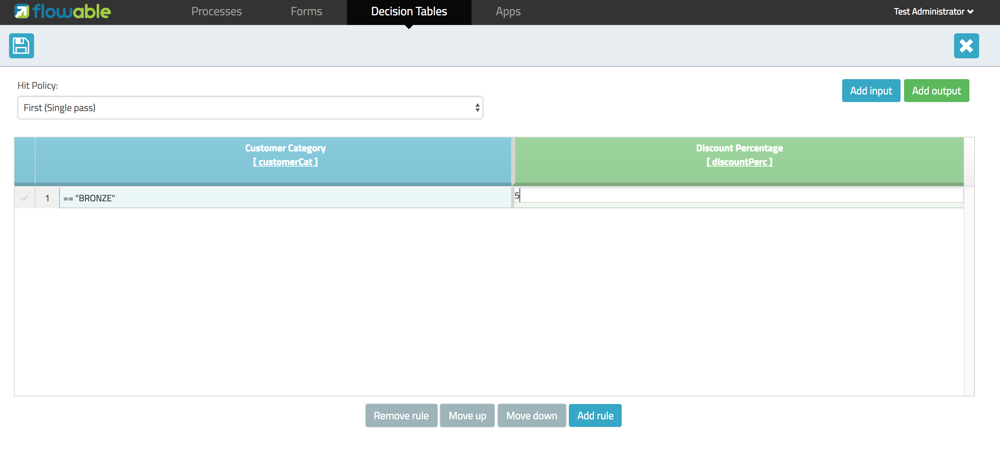

[[bpmn20]]

== DMN 1.1介绍 DMN 1.1 Introduction

[[whatIsDmn]]

=== DMN是什么？ What is DMN?

选择模型与注解(Decision Model and Notation, DMN)是由link:$$http://www.omg.org/spec/DMN/1.1$$[Object Management Group]发布的标准。是用于描述与建模组织中可重复的选择的标准方式，用以确保选择模型可以在组织间公用。

[[dmnDefiningDecision]]

=== DMN定义是什么 What is a DMN definition

DMN 1.1概要(schema)的根元素是**definitions**元素。在这个元素内，可以定义多个选择定义（尽管我们建议在每个文件中，只有一个选择定义。这样可以简化之后再部署过程的管理）。在每个选择中，可以定义一个表达式。表达式有多种类型。在Flowable中，目前只支持**选择表(decision table)**类型的表达式。

[source,xml,linenums]
----
<definitions xmlns="http://www.omg.org/spec/DMN/20151101"
  namespace="http://www.flowable.org/dmn"
  name="DetermineDiscount">

  <decision id="DET_DISC_1" name="DetermineDiscount">

    <decisionTable id="determineDiscountTable1" hitPolicy="FIRST">
      ..
    </decisionTable>

  </decision>

</definitions>
----

=== 创建一个DMN定义 Creating a DMN definition

可以使用文本编辑器创建DMN定义。但是在这个例子中，我们使用Flowable modeler中提供的选择表编辑器创建。

我们将实现一个非常简单的用例：根据用户分类，决定折扣比例。

在Flowable modeler中打开选择表界面。

并选择**Create Decision Table(创建选择表)**。

image::images/decision_tables_2.png[align="center"]

提供一个选择表名，以及唯一的选择表key，并选中**Create new decision table(创建新选择表)**。

image::images/decision_tables_3.png[align="center"]

这样就可以开始定义你的选择表了。让我们介绍一下编辑器的界面。

==== 命中策略 Hit Policy

在左上角可以选择一个**命中策略**。

可以使用两种命中策略：**first(首先，单选)**和**any(任意，单选)**。若使用首先命中策略，则选择表的执行会在某条规则有效时停止。若使用任意命中策略，将执行所有有效的规则。

==== 输入与输出表达式 Input and Output expressions

选择表分成两个区域：蓝色和绿色。在蓝色区域中是**输入表达式**；在绿色区域中是**输出表达式**。

image::images/decision_tables_4.png[align="center"]

在输入表达式中，可以定义变量，用于规则输入项(input entries)的表达式（在下面解释）。可以通过选择**Add Input(添加输入)**，定义多个输入表达式。

image::images/decision_tables_5.png[align="center"]

在输出表达式中，可以定义选择表执行结果要创建的变量（变量的值将用于输出项表达式，在下面解释）。可以通过选择**Add Output(添加输出)**，定义多个输出表达式。

==== 规则 Rules

每个规则包含一个或多个输入项，以及一个或多个输出项。输入项是一个表达式，将使用（该列的）输入变量计算。如果所有的输入项都计算为true，则规则结果为true，并将计算输出项。

[NOTE]
====
DMN标准定义了一个表达式语言：(S)-FEEL。目前，我们还不支持这部分标准。在Flowable DMN中，我们使用link:$$https://github.com/mvel/mvel$$[MVEL]作为表达式语言。
====

双击对应的单元格，录入输入表达式。在这个例子中，录入了表达式__== "BRONZE"__。与相应的输入表达式（列头）的变量定义结合，就在运行时产生了完整的表达式__customerCat == "BRONZE"__。

双击对应的单元格，录入输出表达式。在这个例子中，录入了表达式__5__。 这实际上更像一个隐含赋值。当规则的所有输入项都计算为true时，相应的输出项（列）的变量将赋值为5.

我们可以继续添加更多规则（点击Add Rule，添加规则），以完成选择表。

image::images/decision_tables_8.png[align="center"]

在我们的例子中，规则4使用空输入项。空输入项将被引擎计算为true。这意味着如果其他规则都失效的话，规则4的输出将成为选择表的输出。在这个场景中，变量**discountPerc**的值将设置为**0**。

image::images/decision_tables_9.png[align="center"]

这样就可以保存选择表了。需要提供一个唯一的选择表key。

=== 在BPMN2.0流程中使用 Use in a BPMN2.0 process

可以在一个BPMN2.0流程中，引入一个**选择任务(Decision task)**，并选中**引用选择表(Decision table reference)**，来使用新创建的选择表。

image::images/decision_tables_10.png[align="center"]

在上面的流程中，有一个启动表单，为流程实例（及选择表）提供**客户分类(customer category)**。**Display Discount(显示折扣)**用户任务，将使用一个表达式表单字段及表达式${discountperc}，显示选择表的结果。

=== DMN 1.1 XML

上面例子的完整DMN 1.1 XMl如下：

[source,xml,linenums]
----
<definitions xmlns="http://www.omg.org/spec/DMN/20151101" id="definition_052249e2-f35d-11e6-9c45-0242ac120005" name="Determine Discount" namespace="http://www.flowable.org/dmn">
  <decision id="DET_DISC_1" name="Determine Discount">
    <decisionTable id="decisionTable_052249e2-f35d-11e6-9c45-0242ac120005" hitPolicy="FIRST">
      <input label="Customer Category">
        <inputExpression id="inputExpression_5">
          <text>customercat</text>
        </inputExpression>
      </input>
      <output id="outputExpression_6" label="Discount Percentage" name="discountperc" typeRef="number"></output>
      <rule>
        <inputEntry id="inputEntry_5_1">
          <text>== "BRONZE"</text>
        </inputEntry>
        <outputEntry id="outputEntry_6_1">
          <text>5</text>
        </outputEntry>
      </rule>
      <rule>
        <inputEntry id="inputEntry_5_2">
          <text>== "SILVER"</text>
        </inputEntry>
        <outputEntry id="outputEntry_6_2">
          <text>10</text>
        </outputEntry>
      </rule>
      <rule>
        <inputEntry id="inputEntry_5_3">
          <text>== "GOLD"</text>
        </inputEntry>
        <outputEntry id="outputEntry_6_3">
          <text>20</text>
        </outputEntry>
      </rule>
      <rule>
        <inputEntry id="inputEntry_5_4">
          <text></text>
        </inputEntry>
        <outputEntry id="outputEntry_6_4">
          <text>0</text>
        </outputEntry>
      </rule>
    </decisionTable>
  </decision>
</definitions>
----

**在这里请注意，Flowable中使用的选择表key，是DMN XML中的选择id**。